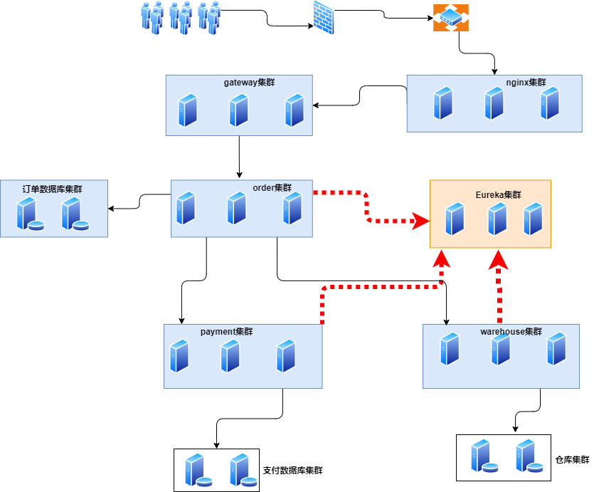

# 功能
1. 是一个spring cloud的小demo，由订单模块、支付模块、仓库模块组成

2. 通过订单模块调用支付模块，如果支付OK，表示下单OK，接着下单模块调用仓库模块进行出库操作，商品数量减少

3. 流程：

   > 1. 订单模块，下单页面，订单数据库插入订单数据，订单状态为：待支付-1001
   > 2. 调用支付模块，跳转支付页面，点击完成支付，订单状态为：支付完成-1002
   > 3. 调用仓库模块，如果仓库模块减少仓库商品成功，订单状态修改为：下单完成-1003
   > 4. 

   

# 架构
1. 注册中心，使用Eureka，数量3
2. 网关，使用spring cloud gateway，数量3，做到负载均衡、高可用集群
3. 服务发现，使用openFeign
4. 服务降级、熔断、限流，使用hystrix
6. 订单模块、支付模块、仓库模块，数量都为3
架构图： 


# 开发环境说明
1. JDK8，64bit
2. maven，3.3.9
3. mysql 8.0.18
4. spring boot 2.2.RELEASE
5. spring cloud Hoxton.SR1

# 开发步骤

# 1、创建父工程

父工程：`order-payment-warehouse`

修改pom.xml文件，锁定用到的jar包版本号，包括spring boot、spring cloud、druid数据源、mybatis、mysql驱动等

```xml
<?xml version="1.0" encoding="UTF-8"?>

<project xmlns="http://maven.apache.org/POM/4.0.0" xmlns:xsi="http://www.w3.org/2001/XMLSchema-instance"
         xsi:schemaLocation="http://maven.apache.org/POM/4.0.0 http://maven.apache.org/xsd/maven-4.0.0.xsd">

    <modelVersion>4.0.0</modelVersion>

    <groupId>com.xywei.springcloud</groupId>
    <artifactId>order-payment-warehouse</artifactId>
    <packaging>pom</packaging>
    <version>1.0-SNAPSHOT</version>
    <modules>
        <module>register-center-10001</module>
        <module>register-center-10002</module>
        <module>register-center-10003</module>
        <module>common-domain</module>
        <module>service-order-11001</module>
        <module>service-order-11002</module>
        <module>service-order-11003</module>
        <module>service-payment-12001</module>
        <module>service-payment-12002</module>
        <module>service-payment-12003</module>
        <module>service-warehouse-13001</module>
        <module>service-warehouse-13002</module>
        <module>service-warehouse-13003</module>
        <module>gateway-9001</module>
        <module>gateway-9002</module>
        <module>gateway-9003</module>
    </modules>

    <name>order-payment-warehouse</name>

    <properties>
        <project.build.sourceEncoding>UTF-8</project.build.sourceEncoding>
        <maven.compiler.source>1.8</maven.compiler.source>
        <maven.compiler.target>1.8</maven.compiler.target>
        <springboot.version>2.2.2.RELEASE</springboot.version>
        <springcloud.version>Hoxton.SR1</springcloud.version>
        <junit.version>4.12</junit.version>
        <log4j.version>1.2.17</log4j.version>
        <mysql.version>5.1.47</mysql.version>
        <druid.version>1.1.16</druid.version>
        <mybatis.spring.boot.version>1.3.0</mybatis.spring.boot.version>
    </properties>

    <!--父工程声明版本号，子工程就不用再写version，但是父工程只是声明，实际没有引入jar包-->
    <dependencyManagement>
        <dependencies>

            <dependency>
                <groupId>org.springframework.boot</groupId>
                <artifactId>spring-boot-dependencies</artifactId>
                <version>${springboot.version}</version>
                <type>pom</type>
                <scope>import</scope>
            </dependency>

            <dependency>
                <groupId>org.springframework.cloud</groupId>
                <artifactId>spring-cloud-dependencies</artifactId>
                <version>${springcloud.version}</version>
                <type>pom</type>
                <scope>import</scope>
            </dependency>

            <dependency>
                <groupId>mysql</groupId>
                <artifactId>mysql-connector-java</artifactId>
                <version>${mysql.version}</version>
            </dependency>

            <dependency>
                <groupId>com.alibaba</groupId>
                <artifactId>druid</artifactId>
                <version>${druid.version}</version>
            </dependency>

            <dependency>
                <groupId>org.mybatis.spring.boot</groupId>
                <artifactId>mybatis-spring-boot-starter</artifactId>
                <version>${mybatis.spring.boot.version}</version>
            </dependency>

            <dependency>
                <groupId>junit</groupId>
                <artifactId>junit</artifactId>
                <version>${junit.version}</version>
            </dependency>

            <dependency>
                <groupId>log4j</groupId>
                <artifactId>log4j</artifactId>
                <version>${log4j.version}</version>
            </dependency>

        </dependencies>
    </dependencyManagement>

    <build>
        <plugins>
            <!--热部署开发，父工程添加插件，子工程添加devtools jar包-->
            <plugin>
                <groupId>org.springframework.boot</groupId>
                <artifactId>spring-boot-maven-plugin</artifactId>
                <configuration>
                    <fork>true</fork>
                    <addResources>true</addResources>
                </configuration>
            </plugin>
        </plugins>
    </build>
</project>

```

# 2、创建注册中心

使用Eureka作为服务注册中心，作为集群配置

## 1、分别创建子模块

分为：register-center-10001/register-center-10002/register-center-10003三个子模块

## 2、分别修改pom.xml文件

导入需要的jar包依赖

```xml

    <dependencies>

        <!--eureka服务端-->
        <dependency>
            <groupId>org.springframework.cloud</groupId>
            <artifactId>spring-cloud-starter-netflix-eureka-server</artifactId>
        </dependency>

        <!--spring boot相关-->
        <dependency>
            <groupId>org.springframework.boot</groupId>
            <artifactId>spring-boot-starter-web</artifactId>
        </dependency>
        <dependency>
            <groupId>org.springframework.boot</groupId>
            <artifactId>spring-boot-starter-actuator</artifactId>
        </dependency>

        <!--热部署开发-->
        <dependency>
            <groupId>org.springframework.boot</groupId>
            <artifactId>spring-boot-devtools</artifactId>
            <scope>runtime</scope>
            <optional>true</optional>
        </dependency>

    </dependencies>

```

## 3、分别修改三个工程的yml文件

搭建集群环境

1. 修改register-center-10001

   ```yaml
   server:
     port: 10001
   
   eureka:
     instance:
       hostname: eureka10001.com
     client:
       register-with-eureka: false #不注册自己
       fetch-registry: false #不检索服务
       service-url:
         # 单机表示设置暴露服务的地址，如果是集群，就表示向其他机器注册自己
         defaultZone: http://eureka10002.com:10002/eureka/, http://eureka10003.com:10003/eureka/
   ```

2. 修改register-center-10002

   ```yaml
   server:
     port: 10002
   
   eureka:
     instance:
       hostname: eureka10002.com
     client:
       register-with-eureka: false #不注册自己
       fetch-registry: false #不检索服务
       service-url:
         # 单机表示设置暴露服务的地址，如果是集群，就表示向其他机器注册自己
         defaultZone: http://eureka10001.com:10001/eureka/, http://eureka10003.com:10003/eureka/
   ```

   

3. 修改register-center-10003

   ```yaml
   server:
     port: 10003
   
   eureka:
     instance:
       hostname: eureka10003.com
     client:
       register-with-eureka: false #不注册自己
       fetch-registry: false #不检索服务
       service-url:
         # 单机表示设置暴露服务的地址，如果是集群，就表示向其他机器注册自己
         defaultZone: http://eureka10002.com:10002/eureka/, http://eureka10001.com:10001/eureka/
   ```


## 4、分别创建启动类

开启Eureka服务，以10001注册中心为示例

```java
@SpringBootApplication
@EnableEurekaServer
public class Register10001 {
    public static void main(String[] args) {
        SpringApplication.run(Register10001.class, args);
    }
}
```

# 3、创建微服务工程

## 1、订单微服务

